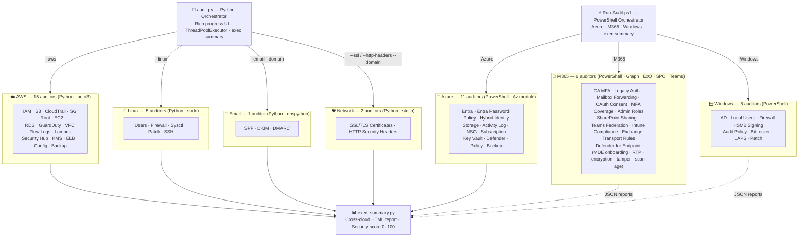

# 🛡️ Security Audit Scripts

[](https://github.com/Decdd19/SecurityAuditScripts/actions/workflows/ci.yml)

Standalone security auditing scripts for AWS, Azure, M365, Windows/Linux on-premises, and network services. No agents, no SaaS — run and review.

---

## Architecture



---

## Quick Start

### Python Orchestrator — AWS · Linux · Email · Network

```bash
git clone https://github.com/Decdd19/SecurityAuditScripts.git
cd SecurityAuditScripts
pip install boto3 rich

# Full AWS + Linux audit, open HTML report when done
sudo python3 audit.py --client "Acme Corp" --aws --linux --open --output ./reports/
```

### PowerShell Orchestrator — Azure · M365 · Windows

```powershell
git clone https://github.com/Decdd19/SecurityAuditScripts.git
cd SecurityAuditScripts
Connect-AzAccount

# All Azure + M365 + Windows, open HTML report when done
.\Run-Audit.ps1 -Client "Acme Corp" -All -AllSubscriptions -Open
```

---

## Orchestrators

### audit.py

Runs AWS, Linux, Email, and Network auditors in parallel with a live Rich progress UI.

```bash
python3 audit.py --client "Acme Corp" --aws --linux --profile prod
python3 audit.py --client "Acme Corp" --aws --regions eu-west-1 us-east-1
python3 audit.py --client "Acme Corp" --email --ssl --http-headers --domain acme.ie
```

**Flags:** `--aws` · `--linux` · `--all` · `--quick` · `--ssl` · `--http-headers` · `--email` · `--domain` · `--profile` · `--regions` · `--output` · `--workers` · `--open`

> `--quick` triage mode: restricts `--aws`/`--linux`/`--all` to the top-5 priority auditors per platform for time-constrained engagements.

> Auto-discovers new `*_auditor.py` scripts — no manual registration needed. Use `tools/add_auditor.py` to scaffold new auditors.

### Run-Audit.ps1

Runs Azure, M365, and Windows on-premises auditors sequentially, then generates the exec summary.

```powershell
.\Run-Audit.ps1 -Client "Acme Corp" -Azure -AllSubscriptions
.\Run-Audit.ps1 -Client "Acme Corp" -M365 -SkipSummary
.\Run-Audit.ps1 -Client "Acme Corp" -All -OutputDir C:\Reports -Open
```

**Flags:** `-Azure` (11) · `-M365` (6) · `-Windows` (8) · `-All` · `-Quick` · `-AllSubscriptions` · `-OutputDir` · `-SkipSummary` · `-Open`

> `-Quick` triage mode: restricts `-Azure`/`-M365`/`-Windows`/`-All` to the top-priority auditors per platform (Azure: 5, M365: 3, Windows: 5).

---

## Scripts

Each auditor produces JSON + CSV + HTML output and maps findings to CIS v8 Controls. See each subdirectory README for full check details.

### AWS (15 auditors)

| Auditor | What it checks |
|---------|----------------|
| [IAM](./AWS/iam-privilege-mapper/) | Privilege escalation paths, stale credentials, MFA gaps |
| [S3](./AWS/s3-auditor/) | Public access, encryption, versioning, logging |
| [CloudTrail](./AWS/cloudtrail-auditor/) | Multi-region coverage, KMS encryption, CloudWatch integration |
| [Security Groups](./AWS/sg-auditor/) | Open ports, unrestricted ingress, unused groups |
| [Root Account](./AWS/root-auditor/) | MFA, access keys, password policy, alternate contacts |
| [EC2](./AWS/ec2-auditor/) | IMDSv2, EBS encryption, public IPs, public snapshots |
| [RDS](./AWS/rds-auditor/) | Public access, encryption, backups, multi-AZ |
| [GuardDuty](./AWS/guardduty-auditor/) | Enablement, finding counts, S3/EKS/Malware/RDS/Runtime protection |
| [VPC Flow Logs](./AWS/vpcflowlogs-auditor/) | Per-VPC coverage, traffic type, retention |
| [Lambda](./AWS/lambda-auditor/) | Public URLs, IAM roles, secrets in env vars, deprecated runtimes |
| [Security Hub](./AWS/securityhub-auditor/) | Enablement, findings, CIS/PCI DSS/FSBP compliance |
| [KMS](./AWS/kms-auditor/) | CMK rotation, key policy, state, unaliased keys |
| [ELB](./AWS/elb-auditor/) | Access logging, TLS policy, HTTP→HTTPS redirect, WAF (ALB) |
| [Config](./AWS/config-auditor/) | Enablement, rules, compliance, recording coverage |
| [Backup](./AWS/backup-auditor/) | Vault coverage, retention, encryption |

### Azure (11 auditors)

| Auditor | What it checks |
|---------|----------------|
| [Entra ID](./Azure/entra-auditor/) | MFA, guest roles, app credentials, privilege escalation |
| [Entra Password Policy](./Azure/entrapwd-auditor/) | Expiry, SSPR, smart lockout, security defaults, banned passwords |
| [Hybrid Identity](./Azure/hybrid-auditor/) | AAD Connect sync staleness, PHS, writeback, accidental deletion, SSO |
| [Storage](./Azure/storage-auditor/) | Public access, shared key auth, encryption, soft delete |
| [Activity Log](./Azure/activitylog-auditor/) | Diagnostic settings, retention, alerting gaps |
| [NSG](./Azure/nsg-auditor/) | Open ports, internet-exposed rules, orphaned groups |
| [Subscription](./Azure/subscription-auditor/) | Defender for Cloud, PIM, Global Admin hygiene |
| [Key Vault](./Azure/keyvault-auditor/) | RBAC, purge protection, soft delete, expired secrets/certs/keys |
| [Defender for Cloud](./Azure/defender-auditor/) | Plan enablement, secure score, security contacts |
| [Policy](./Azure/policy-auditor/) | Assignments, compliance state, exemptions |
| [Backup](./Azure/backup-auditor/) | Vault coverage, retention, redundancy, soft delete |

### M365 (6 auditors)

| Auditor | What it checks |
|---------|----------------|
| [M365 Core](./M365/m365-auditor/) | CA MFA, legacy auth, mailbox forwarding, OAuth consent, MFA coverage, admin roles |
| [SharePoint](./M365/sharepoint-auditor/) | External sharing, anonymous links, OneDrive settings, domain restrictions |
| [Teams](./M365/teams-auditor/) | External federation, guest access, meeting lobby, recording expiry |
| [Intune](./M365/intune-auditor/) | Device compliance policies, CA enforcement, Windows auto-enrollment |
| [Exchange](./M365/exchange-auditor/) | Transport rules, auto-forwarding, delegation, audit logging, SMTP AUTH |
| [Defender for Endpoint](./M365/mde-auditor/) | MDE onboarding, real-time protection, BitLocker, tamper protection, scan staleness |

### Windows On-Premises (8 auditors)

| Auditor | What it checks |
|---------|----------------|
| [Active Directory](./OnPrem/Windows/ad-auditor/) | Stale accounts, Kerberoastable users, weak policy, unconstrained delegation |
| [Local Users](./OnPrem/Windows/localuser-auditor/) | Local accounts, registry autologon, WDigest, NTLMv1, LAPS detection |
| [Windows Firewall](./OnPrem/Windows/winfirewall-auditor/) | Disabled profiles, default-allow policies, dangerous open ports |
| [SMB Signing](./OnPrem/Windows/smbsigning-auditor/) | Server and client signing enforcement (NTLM relay prevention) |
| [Audit Policy](./OnPrem/Windows/auditpolicy-auditor/) | 15 critical subcategories vs CIS baseline |
| [BitLocker](./OnPrem/Windows/bitlocker-auditor/) | Drive encryption status, method strength, TPM protector |
| [LAPS](./OnPrem/Windows/laps-auditor/) | Deployment coverage, password age, expiry configuration |
| [Windows Patch](./OnPrem/Windows/winpatch-auditor/) | Last patch age, reboot state, auto-update policy, pending security updates |

### Linux On-Premises (5 auditors)

| Auditor | What it checks |
|---------|----------------|
| [Users](./OnPrem/Linux/linux-user-auditor/) | Accounts, sudo rules, SSH config, password policy, stale accounts |
| [Firewall](./OnPrem/Linux/linux-firewall-auditor/) | iptables/nftables/ufw/firewalld, auditd, syslog |
| [Sysctl](./OnPrem/Linux/linux-sysctl-auditor/) | 24 CIS Benchmark kernel parameters |
| [Patch](./OnPrem/Linux/linux-patch-auditor/) | Available updates, auto-update agent, kernel version (apt/yum/dnf/zypper) |
| [SSH](./OnPrem/Linux/linux-ssh-auditor/) | 21 sshd hardening parameters via `sshd -T` |

### Email & Network

| Auditor | What it checks |
|---------|----------------|
| [Email Security](./Email/email-security-auditor/) | SPF, DKIM, DMARC — DNS queries only, no credentials |
| [SSL/TLS](./Network/ssl-tls-auditor/) | Cert expiry, TLS version, weak ciphers, HSTS |
| [HTTP Headers](./Network/http-headers-auditor/) | X-Frame-Options, CSP, Referrer-Policy, Permissions-Policy |
| [Network Exposure](./OnPrem/Windows/netexpose-auditor/) | LAN port scan — RDP/SMB/WinRM/LDAP/MSSQL per host in CIDR range |

### Cross-Cloud

| Script | What it does |
|--------|--------------|
| [Executive Summary](./tools/) | Aggregates all JSON reports → HTML report with score 0–100, pillar cards, top findings, quick wins |

---

## Requirements

| Platform | Runtime | Key dependencies |
|----------|---------|-----------------|
| AWS | Python 3.7+ | `pip install boto3 rich` · AWS credentials |
| Azure | PowerShell 7+ | `Install-Module Az.*` · `Connect-AzAccount` |
| M365 | PowerShell 7+ | `Install-Module Microsoft.Graph ExchangeOnlineManagement` |
| Windows on-prem | PowerShell 5.1+ | Run as local admin · RSAT for ad-auditor |
| Linux on-prem | Python 3.7+ | No deps · `sudo` for SSH auditor only |
| Email | Python 3.7+ | `pip install dnspython` · No credentials |
| Network | Python 3.8+ | No deps · No credentials |

> See each subdirectory README for full module lists and connect commands.

---

## Notes

- Scripts are **read-only** — no changes are made to your environment
- Output files are created with owner-only permissions (mode 600)
- All JSON findings include a `cis_control` field mapped to CIS v8 Controls
- AWS/Linux scripts output to current directory unless `--output` is set; PowerShell scripts default to a timestamped client folder
- AWS scripts support `--profile` and `--regions`; Azure scripts support `-AllSubscriptions`

---

## Contributing

Pull requests and issues welcome. Use `tools/add_auditor.py` to scaffold new auditors — it auto-wires the script into `audit.py` and `exec_summary.py`.

### Local test setup

```bash
pip install -r requirements-test.txt
pytest AWS/ OnPrem/Linux/ Network/ Email/ tests/ -v --import-mode=importlib
```

---

## Disclaimer

These scripts are provided for **internal security auditing purposes only**. Always ensure you have appropriate authorisation before running security tooling against any environment.
