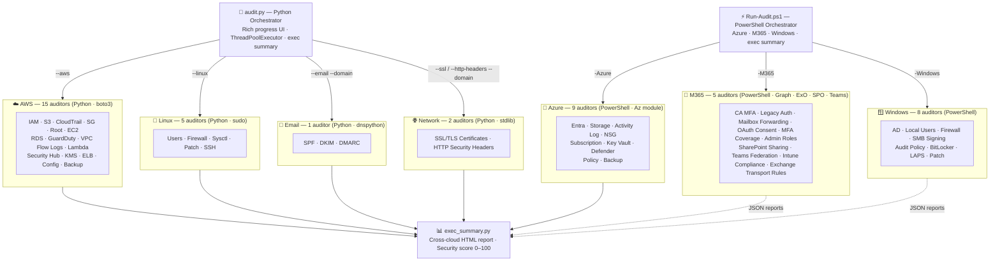

# 🛡️ Security Audit Scripts

[](https://github.com/Decdd19/SecurityAuditScripts/actions/workflows/ci.yml)

A collection of security auditing scripts for AWS, Azure, M365, on-premises infrastructure, and network services. Built for security engineers and consultants who want real visibility into client environments without relying on commercial tooling.

> **Purpose:** Practical, standalone scripts that give you real security insight. No agents, no SaaS dependencies — just run and review.

---

## Contents

- [Architecture](#-architecture)
- [Orchestrators](#-orchestrators)
  - [audit.py — Python (AWS · Linux · Email · Network)](#auditpy--python)
  - [Run-Audit.ps1 — PowerShell (Azure · M365 · Windows)](#run-auditps1--powershell)
- [Repository Structure](#-repository-structure)
- [Scripts](#-scripts)
- [Requirements](#-requirements)
- [Quick Start](#-quick-start)
- [Notes](#-notes)
- [Contributing](#-contributing)

---

## 🗺️ Architecture



---

## 🎯 Orchestrators

### audit.py — Python

Runs any combination of AWS, Linux, Email, and Network auditors in parallel with a live Rich progress UI, then generates an executive summary on completion.

```bash
# Full AWS + Linux audit for a client
python3 audit.py --client "Acme Corp" --aws --linux --output ./reports/

# Everything — AWS, Linux, plus Azure/Windows instructions
python3 audit.py --client "Acme Corp" --all --profile prod

# Multi-region AWS scan
python3 audit.py --client "Acme Corp" --aws --regions eu-west-1 us-east-1

# Cherry-pick specific auditors
python3 audit.py --client "Acme Corp" --s3 --ec2 --iam --linux_user

# Open executive summary in browser when complete
python3 audit.py --client "Acme Corp" --all --open
```

**Flags:** `--aws` (all 15 AWS) · `--linux` (all 5 Linux) · `--all` · `--ssl --domain` · `--http-headers --domain` · `--email --domain` · `--profile` · `--regions` · `--output` · `--format` · `--workers` · `--open`

> **Prerequisites:** `pip install boto3 rich` · AWS credentials configured · Run with `sudo` for Linux auditors

> **Auto-discovery:** `audit.py` automatically discovers new `*_auditor.py` scripts — no manual `AUDITOR_MAP` edits needed for scripts following the naming convention. Use `tools/add_auditor.py` to scaffold new auditors.

---

### Run-Audit.ps1 — PowerShell

The PowerShell equivalent of `audit.py`. Runs all Azure, M365, and Windows on-premises PS1 auditors sequentially, saves output to a timestamped client folder, and optionally invokes `exec_summary.py` to generate the HTML report.

```powershell
# All Azure auditors for a client
.\Run-Audit.ps1 -Client "Acme Corp" -Azure

# All Azure auditors across every subscription + open HTML report
.\Run-Audit.ps1 -Client "Acme Corp" -Azure -AllSubscriptions -Open

# Everything — Azure + M365 + Windows on-prem (run as admin)
.\Run-Audit.ps1 -Client "Acme Corp" -All -OutputDir C:\Reports

# M365 only, skip exec summary
.\Run-Audit.ps1 -Client "Acme Corp" -M365 -SkipSummary
```

**Flags:** `-Azure` (9 auditors) · `-M365` (5 auditors) · `-Windows` (LAPS) · `-All` · `-AllSubscriptions` · `-OutputDir` · `-SkipSummary` · `-Open`

> **Prerequisites:** PowerShell 7+ · Az module · `Connect-AzAccount` already run · Python 3 for exec summary (optional)

---

## 📁 Repository Structure

```
SecurityAuditScripts/
├── README.md
├── audit.py                            # Python orchestrator (auto-discovers auditors via AST scan)
├── Run-Audit.ps1                       # PowerShell orchestrator (Azure · M365 · Windows)
├── scoring.py                          # Grade engine — compute_overall_score(), unit-tested
├── schema.py                           # Canonical FindingSchema + validate_finding()
├── report_utils.py                     # Shared HTML/CSS generator for auditor reports
├── AWS/
│   ├── README.md
│   ├── iam-privilege-mapper/           # IAM users, roles, privilege escalation paths
│   ├── s3-auditor/                     # S3 bucket public access, encryption, versioning
│   ├── cloudtrail-auditor/             # CloudTrail coverage and logging gaps
│   ├── sg-auditor/                     # Security group open ports and ingress rules
│   ├── root-auditor/                   # Root account MFA, access keys, password policy
│   ├── ec2-auditor/                    # EC2 IMDS v2, EBS encryption, public IPs, snapshots
│   ├── rds-auditor/                    # RDS public access, encryption, backups, multi-AZ
│   ├── guardduty-auditor/              # GuardDuty enablement, findings, protection plans
│   ├── vpcflowlogs-auditor/            # VPC flow log coverage, traffic type, retention
│   ├── lambda-auditor/                 # Lambda public URLs, IAM roles, secret env vars
│   ├── securityhub-auditor/            # Security Hub enablement, findings, standards
│   ├── kms-auditor/                    # KMS CMK rotation, key policy, state, aliases
│   ├── elb-auditor/                    # ALB/NLB access logging, TLS policy, WAF, HTTPS
│   ├── config-auditor/                 # AWS Config enablement, rules, compliance coverage
│   └── backup-auditor/                 # AWS Backup vault coverage, retention, encryption
├── tools/
│   ├── exec_summary.py                 # Cross-cloud executive summary (aggregates all JSON reports)
│   └── add_auditor.py                  # Scaffold a new auditor stub + auto-wire into audit.py
├── Azure/
│   ├── README.md
│   ├── entra-auditor/                  # Entra ID MFA, guest roles, app credentials, privesc
│   ├── storage-auditor/                # Storage account public access, encryption, soft delete
│   ├── activitylog-auditor/            # Activity Log diagnostic settings and alerting
│   ├── nsg-auditor/                    # NSG open ports, orphaned groups
│   ├── subscription-auditor/           # Defender for Cloud, PIM, Global Admin hygiene
│   ├── keyvault-auditor/               # Key Vault RBAC, soft delete, secret/cert/key expiry
│   ├── defender-auditor/               # Defender for Cloud plans, secure score, contacts
│   ├── policy-auditor/                 # Azure Policy assignments, compliance state, exemptions
│   └── backup-auditor/                 # Azure Backup vault coverage, retention, redundancy
├── M365/
│   ├── m365-auditor/                   # CA MFA, legacy auth, mailbox forwarding, OAuth consent
│   ├── sharepoint-auditor/             # SharePoint/OneDrive external sharing (SP-01–SP-06)
│   ├── teams-auditor/                  # Teams federation, guest access, meeting policies (TM-01–TM-06)
│   ├── intune-auditor/                 # Intune device compliance and CA enforcement (IN-01–IN-05)
│   └── exchange-auditor/               # Transport rules, delegation, audit logging (EX-01–EX-08)
├── Email/
│   ├── README.md
│   └── email-security-auditor/         # SPF, DKIM, DMARC DNS checks
├── Network/
│   ├── README.md
│   ├── ssl-tls-auditor/                # SSL/TLS cert expiry, hostname, TLS version, cipher, HSTS
│   └── http-headers-auditor/           # X-Frame-Options, CSP, Referrer-Policy, Permissions-Policy
└── OnPrem/
    ├── README.md
    ├── Windows/
    │   ├── ad-auditor/                 # Active Directory hygiene, Kerberoasting, delegation
    │   ├── localuser-auditor/          # Local users, registry, NTLM, LAPS, WDigest
    │   ├── winfirewall-auditor/        # Firewall profiles, open ports, rule analysis
    │   ├── smbsigning-auditor/         # SMB signing enforcement, NTLM relay prevention
    │   ├── auditpolicy-auditor/        # Audit policy subcategories (process, logon, privilege)
    │   ├── bitlocker-auditor/          # BitLocker drive encryption status and method
    │   ├── laps-auditor/               # LAPS deployment coverage and configuration
    │   └── winpatch-auditor/          # Patch currency, uptime, WU config, pending updates
    └── Linux/
        ├── linux-user-auditor/         # Users, sudo, SSH, password policy
        ├── linux-firewall-auditor/     # iptables/nftables/ufw/firewalld, auditd, syslog
        ├── linux-sysctl-auditor/       # Kernel hardening, 24 CIS sysctl parameters
        ├── linux-patch-auditor/        # Available updates, auto-update agent, kernel version
        └── linux-ssh-auditor/          # SSH daemon hardening via sshd -T (21 checks)
```

---

## 🛠️ Scripts

### AWS

| Script | Description | Output |
|--------|-------------|--------|
| [IAM Privilege Mapper](./AWS/iam-privilege-mapper/) | Maps IAM users, roles, and groups. Identifies high-risk permissions, privilege escalation paths, stale credentials, and MFA gaps. | JSON, CSV, HTML |
| [S3 Bucket Auditor](./AWS/s3-auditor/) | Audits all S3 buckets for public access, missing encryption, versioning, logging, and lifecycle policies. | JSON, CSV, HTML |
| [CloudTrail Auditor](./AWS/cloudtrail-auditor/) | Checks CloudTrail coverage across all regions for logging gaps, missing KMS encryption, and CloudWatch integration. | JSON, CSV, HTML |
| [Security Group Auditor](./AWS/sg-auditor/) | Scans all security groups across all regions for dangerous open ports, unrestricted ingress, and unused groups. | JSON, CSV, HTML |
| [Root Account Auditor](./AWS/root-auditor/) | Audits root account security posture including MFA, access keys, password policy, and alternate contacts. | JSON, CSV, HTML |
| [EC2 Auditor](./AWS/ec2-auditor/) | Audits EC2 instances across all regions for IMDSv2 enforcement, EBS encryption, public IPs, public snapshots, IAM instance profiles, and default VPC usage. | JSON, CSV, HTML |
| [RDS Auditor](./AWS/rds-auditor/) | Audits RDS databases for public accessibility, storage encryption, backup retention, deletion protection, IAM authentication, and multi-AZ deployment. | JSON, CSV, HTML |
| [GuardDuty Auditor](./AWS/guardduty-auditor/) | Checks GuardDuty enablement across all regions, active finding counts by severity, protection plan coverage (S3/EKS/Malware/RDS/Runtime), and findings export configuration. | JSON, CSV, HTML |
| [VPC Flow Logs Auditor](./AWS/vpcflowlogs-auditor/) | Audits VPC flow log coverage per VPC per region. Flags missing logs (CRITICAL), ACCEPT/REJECT-only logs, default log format, and short CloudWatch retention periods. | JSON, CSV, HTML |
| [Lambda Auditor](./AWS/lambda-auditor/) | Audits Lambda functions for public function URLs with no auth, overly-permissive IAM roles, secrets in environment variable names, deprecated runtimes, missing DLQs, and X-Ray tracing. | JSON, CSV, HTML |
| [Security Hub Auditor](./AWS/securityhub-auditor/) | Checks Security Hub enablement across all regions, active finding counts by severity, and enabled compliance standards (CIS, PCI DSS, FSBP) with control pass rates. | JSON, CSV, HTML |
| [KMS Auditor](./AWS/kms-auditor/) | Audits customer-managed KMS keys across all regions for disabled rotation, dangerous key policies (public/cross-account wildcard), key state, unaliased keys, and key spec. | JSON, CSV, HTML |
| [ELB Auditor](./AWS/elb-auditor/) | Audits Application and Network Load Balancers for missing access logging, no deletion protection, HTTP→HTTPS redirect gaps (ALB), outdated TLS policies, and missing WAF association (ALB). | JSON, CSV, HTML |
| [Config Auditor](./AWS/config-auditor/) | Checks AWS Config enablement per region, active rule counts, compliance status, and recording coverage gaps. | JSON, CSV, HTML |
| [Backup Auditor](./AWS/backup-auditor/) | Audits AWS Backup vault coverage, backup plan assignments, retention policy, and encryption configuration across all supported resource types. | JSON, CSV, HTML |

### Azure

| Script | Description | Output |
|--------|-------------|--------|
| [Entra Auditor](./Azure/entra-auditor/) | Audits Entra ID users, guest access, app credentials, custom roles, and privilege escalation paths. | JSON, CSV, HTML |
| [Storage Auditor](./Azure/storage-auditor/) | Audits Storage Accounts for public access, shared key auth, encryption, soft delete, versioning, and logging. | JSON, CSV, HTML |
| [Activity Log Auditor](./Azure/activitylog-auditor/) | Checks Activity Log diagnostic settings for coverage, retention, missing categories, and alerting gaps. | JSON, CSV, HTML |
| [NSG Auditor](./Azure/nsg-auditor/) | Scans Network Security Groups for dangerous open ports, internet-exposed rules, and orphaned groups. | JSON, CSV, HTML |
| [Subscription Auditor](./Azure/subscription-auditor/) | Audits subscription posture including Defender for Cloud, permanent privileged roles, Global Admin hygiene, and budget alerts. | JSON, CSV, HTML |
| [Key Vault Auditor](./Azure/keyvault-auditor/) | Audits Key Vaults for RBAC vs legacy access policy, purge protection, soft delete, diagnostic logging, and expired or expiring secrets, certificates, and keys. | JSON, CSV, HTML |
| [Defender Auditor](./Azure/defender-auditor/) | Audits Defender for Cloud plan enablement per resource type, secure score, security contacts, and auto-provisioning of monitoring agents. | JSON, CSV, HTML |
| [Policy Auditor](./Azure/policy-auditor/) | Checks Azure Policy assignments, compliance state, and exemptions across the subscription or management group. | JSON, CSV, HTML |
| [Backup Auditor](./Azure/backup-auditor/) | Audits Azure Backup vault coverage, backup policies, retention rules, redundancy settings, and soft-delete configuration. | JSON, CSV, HTML |

### M365 / Exchange Online

| Script | Description | Output |
|--------|-------------|--------|
| [M365 Auditor](./M365/m365-auditor/) | Audits Microsoft 365 tenant security controls — Conditional Access MFA enforcement, legacy authentication blocking, Exchange Online mailbox auto-forwarding and inbox forwarding rules, OAuth app user consent policy, per-user MFA registration coverage, privileged admin role enumeration, and guest/external user review. Requires Microsoft.Graph and ExchangeOnlineManagement modules. | JSON, CSV, HTML |
| [SharePoint Auditor](./M365/sharepoint-auditor/) | Audits SharePoint Online and OneDrive external sharing — anonymous link policies, OneDrive sharing settings, sites more permissive than tenant default, default link type, and domain restrictions. Requires SharePoint Online Management Shell. | JSON, CSV, HTML |
| [Teams Auditor](./M365/teams-auditor/) | Audits Microsoft Teams security posture — external federation, guest access and channel permissions, meeting lobby bypass, recording expiry, and app installation policies. Requires MicrosoftTeams module. | JSON, CSV, HTML |
| [Intune Auditor](./M365/intune-auditor/) | Audits Intune device compliance — missing platform policies, grace period, CA device enforcement, non-compliant device access, and Windows auto-enrollment. Requires Microsoft.Graph module. | JSON, CSV, HTML |
| [Exchange Auditor](./M365/exchange-auditor/) | Audits Exchange Online transport rules, remote domain auto-forwarding, mailbox FullAccess delegation, shared mailbox sign-in, per-mailbox and admin audit logging, and SMTP AUTH. Requires ExchangeOnlineManagement and Microsoft.Graph modules. | JSON, CSV, HTML |

### On-Premises — Windows

| Script | Description | Output |
|--------|-------------|--------|
| [AD Auditor](./OnPrem/Windows/ad-auditor/) | Audits Active Directory for stale accounts, Kerberoastable users, weak password policy, unconstrained delegation, and privileged group hygiene. | JSON, CSV, HTML |
| [Local User Auditor](./OnPrem/Windows/localuser-auditor/) | Audits local accounts, registry autologon, WDigest, NTLMv1, LAPS detection, and local admin group membership. | JSON, CSV, HTML |
| [Windows Firewall Auditor](./OnPrem/Windows/winfirewall-auditor/) | Audits Windows Firewall profiles and rules for disabled profiles, default-allow policies, and dangerous ports open to any source. | JSON, CSV, HTML |
| [SMB Signing Auditor](./OnPrem/Windows/smbsigning-auditor/) | Checks SMB signing enforcement on server and client. Missing server-side enforcement allows NTLM relay attacks. | JSON, CSV, HTML |
| [Audit Policy Auditor](./OnPrem/Windows/auditpolicy-auditor/) | Checks 15 critical Windows audit policy subcategories (logon, process creation, privilege use, etc.) against CIS baseline. | JSON, CSV, HTML |
| [BitLocker Auditor](./OnPrem/Windows/bitlocker-auditor/) | Audits BitLocker drive encryption status, encryption method strength, TPM protector, and recovery password configuration. | JSON, CSV, HTML |
| [LAPS Auditor](./OnPrem/Windows/laps-auditor/) | Checks LAPS deployment coverage across domain-joined computers — managed vs unmanaged machines, password age, and expiry configuration. | JSON, CSV, HTML |
| [Windows Patch Auditor](./OnPrem/Windows/winpatch-auditor/) | Checks last patch age via `Get-HotFix`, system uptime and reboot state, Windows Update service and auto-update policy, and enumerates pending security updates via the Windows Update Agent COM API. | JSON, CSV, HTML |

### On-Premises — Linux

| Script | Description | Output |
|--------|-------------|--------|
| [Linux User Auditor](./OnPrem/Linux/linux-user-auditor/) | Audits Linux user accounts, sudo rules, SSH configuration, password policy from login.defs, and stale accounts. | JSON, CSV, HTML |
| [Linux Firewall Auditor](./OnPrem/Linux/linux-firewall-auditor/) | Auto-detects and audits iptables/nftables/ufw/firewalld. Also checks auditd rules and syslog configuration. | JSON, CSV, HTML |
| [Linux Sysctl Auditor](./OnPrem/Linux/linux-sysctl-auditor/) | Checks 24 CIS Benchmark kernel parameters via sysctl: network hardening, TCP, ASLR, dmesg restriction, ptrace scope, protected hardlinks/symlinks. | JSON, CSV, HTML |
| [Linux Patch Auditor](./OnPrem/Linux/linux-patch-auditor/) | Auto-detects apt/yum/dnf/zypper and counts available updates (total and security-specific), checks auto-update agent, last update timestamp, and kernel upgrade status. | JSON, CSV, HTML |
| [Linux SSH Auditor](./OnPrem/Linux/linux-ssh-auditor/) | Reads the effective SSH daemon configuration via `sshd -T` and checks 21 hardening parameters: root login, password auth, crypto ciphers/MACs/KEX, X11 forwarding, session timeouts, and more. | JSON, CSV, HTML |

### Cross-Cloud

| Script | Description | Output |
|--------|-------------|--------|
| [Executive Summary](./tools/) | Aggregates JSON reports from all auditors into a single executive HTML report with an overall security score (0–100), per-pillar risk cards, top findings, and quick wins. Invoked automatically by both orchestrators. | HTML |

### Email

| Script | Description | Output |
|--------|-------------|--------|
| [Email Security Auditor](./Email/email-security-auditor/) | Audits a domain's email security DNS configuration — SPF, DKIM, and DMARC. No cloud credentials required; DNS queries only. | JSON, CSV, HTML |

### Network

| Script | Description | Output |
|--------|-------------|--------|
| [SSL/TLS Auditor](./Network/ssl-tls-auditor/) | Audits a domain's SSL/TLS certificate and TLS configuration — cert expiry, hostname match, self-signed detection, key algorithm, TLS version (min 1.2), weak cipher suite, and HSTS header. No credentials required; TCP port 443 only. | JSON, CSV, HTML |
| [HTTP Security Headers Auditor](./Network/http-headers-auditor/) | Audits a domain's HTTP security response headers over HTTPS — X-Frame-Options, X-Content-Type-Options, Content-Security-Policy (with unsafe-inline/eval detection), Referrer-Policy, and Permissions-Policy. No credentials required; HTTPS port 443 only. | JSON, CSV, HTML |

---

## ⚙️ Requirements

### AWS

- Python 3.7+
- `boto3` (`pip install boto3`)
- AWS credentials configured

Authentication order:
1. **AWS CloudShell** — credentials are pre-configured, just upload and run
2. **Environment variables:**
   ```bash
   export AWS_ACCESS_KEY_ID=your_key
   export AWS_SECRET_ACCESS_KEY=your_secret
   export AWS_DEFAULT_REGION=us-east-1
   ```
3. **AWS CLI profile** (`aws configure`) — most scripts support `--profile` flag
4. **IAM role** — if running on EC2/Lambda, the instance/execution role is used automatically

### Azure

- PowerShell 7+
- Az PowerShell module + Microsoft Graph SDK (see each script's README for exact modules)
- Active Az context (`Connect-AzAccount` already run)

```powershell
# Install core Az modules
Install-Module Az.Accounts, Az.Resources, Az.Network, Az.Storage, Az.Monitor, Az.Security, Az.KeyVault -Scope CurrentUser

# Install Graph modules (required by entra-auditor and subscription-auditor)
Install-Module Microsoft.Graph.Authentication, Microsoft.Graph.Users, Microsoft.Graph.Identity.Governance -Scope CurrentUser

Connect-AzAccount
```

### M365 / Exchange Online

- PowerShell 7+
- Microsoft Graph SDK for CA policies and consent policy
- ExchangeOnlineManagement for mailbox and inbox rule checks

```powershell
Install-Module Microsoft.Graph -Scope CurrentUser -Force
Install-Module ExchangeOnlineManagement -Scope CurrentUser -Force

Connect-MgGraph -Scopes "Policy.Read.All","Application.Read.All","User.Read.All","Directory.Read.All","UserAuthenticationMethod.Read.All"
Connect-ExchangeOnline -UserPrincipalName admin@contoso.com
```

### Email

- Python 3.7+
- `dnspython` (`pip install dnspython`)
- No credentials required — DNS queries only

### Network

- Python 3.8+
- No external dependencies (stdlib only)
- No credentials required — outbound TCP/HTTPS port 443 only

### On-Premises

**Windows scripts:**
- PowerShell 5.1+ or 7+
- Run as local administrator (localuser-auditor, winfirewall-auditor)
- RSAT ActiveDirectory module for ad-auditor (domain-joined machine)

**Linux scripts:**
- Python 3.7+
- Most auditors run without `sudo`. The SSH auditor requires `sudo` to invoke `sshd -T`; without it all SSH checks return N/A.

---

## 🚀 Quick Start

### Python Orchestrator — AWS + Linux

```bash
git clone https://github.com/Decdd19/SecurityAuditScripts.git
cd SecurityAuditScripts
pip install boto3 rich

# Full AWS + Linux audit, open HTML report when done
sudo python3 audit.py --client "Acme Corp" --aws --linux --open --output ./reports/
```

### PowerShell Orchestrator — Azure + M365 + Windows

```powershell
git clone https://github.com/Decdd19/SecurityAuditScripts.git
cd SecurityAuditScripts
Connect-AzAccount

# All Azure auditors, open HTML report when done
.\Run-Audit.ps1 -Client "Acme Corp" -Azure -Open

# Everything — Azure + M365 + Windows on-prem (run as admin)
.\Run-Audit.ps1 -Client "Acme Corp" -All -AllSubscriptions -Open
```

### AWS — individual scripts

```bash
git clone https://github.com/Decdd19/SecurityAuditScripts.git
cd SecurityAuditScripts
pip install boto3

python3 AWS/iam-privilege-mapper/iam_mapper_v2.py --format html --output iam_report
python3 AWS/s3-auditor/s3_auditor.py --format all --output s3_report
python3 AWS/ec2-auditor/ec2_auditor.py --format all --output ec2_report
```

### Azure — individual scripts

```powershell
git clone https://github.com/Decdd19/SecurityAuditScripts.git
cd SecurityAuditScripts
Connect-AzAccount

.\Azure\entra-auditor\entra_auditor.ps1 -Format html
.\Azure\keyvault-auditor\keyvault_auditor.ps1 -Format all
.\Azure\defender-auditor\defender_auditor.ps1 -AllSubscriptions -Format html
```

### M365

```powershell
# Connect first — see M365 requirements above
.\M365\m365-auditor\m365_auditor.ps1 -TenantDomain contoso.com -Format all
```

### On-Premises — Windows

```powershell
# Run as administrator
.\OnPrem\Windows\winfirewall-auditor\winfirewall_auditor.ps1 -Format html
.\OnPrem\Windows\localuser-auditor\localuser_auditor.ps1 -Format all
.\OnPrem\Windows\ad-auditor\ad_auditor.ps1 -Format html  # domain-joined only
```

### On-Premises — Linux

```bash
# Most auditors run without sudo
python3 OnPrem/Linux/linux-user-auditor/linux_user_auditor.py --format html
python3 OnPrem/Linux/linux-firewall-auditor/linux_firewall_auditor.py --format all
python3 OnPrem/Linux/linux-sysctl-auditor/linux_sysctl_auditor.py --format all
python3 OnPrem/Linux/linux-patch-auditor/linux_patch_auditor.py --format all

# SSH auditor requires sudo for sshd -T
sudo python3 OnPrem/Linux/linux-ssh-auditor/linux_ssh_auditor.py --format html
```

### Email + Network

```bash
python3 Email/email-security-auditor/email_security_auditor.py --domain acme.ie --format all
python3 Network/ssl-tls-auditor/ssl_tls_auditor.py --domain acme.ie --format all
python3 Network/http-headers-auditor/http_headers_auditor.py --domain acme.ie --format all

# Via orchestrator
python3 audit.py --client "Acme Corp" --email --ssl --http-headers --domain acme.ie
```

---

## 📌 Notes

- Scripts are **read-only** — they query configuration and do not make any changes to your environment
- AWS scripts are designed to run in **AWS CloudShell**; Azure scripts run in **Azure CloudShell** or locally; OnPrem scripts run directly on the target machine
- Output files are written to the current working directory unless `--output` / `-Output` or `--output-dir` / `-OutputDir` is specified
- All output files are created with owner-only permissions (mode 600)
- All JSON findings include a `cis_control` field mapping each finding to its primary CIS v8 Control
- AWS scripts support `--format` (json, csv, html, all, stdout) and `--profile`; EC2/RDS/Lambda also accept `--regions`
- Azure scripts support `-Format` (json, csv, html, all, stdout) and `-AllSubscriptions`
- OnPrem and Network scripts support `--format` (json, csv, html, all, stdout)

---

## 🤝 Contributing

Pull requests and issues are welcome. To add a new auditor, use `tools/add_auditor.py` to scaffold the stub — it wires the script into `audit.py` and `exec_summary.py` automatically.

---

## ⚠️ Disclaimer

These scripts are provided for **internal security auditing purposes only**. Always ensure you have appropriate authorisation before running security tooling against any environment.
