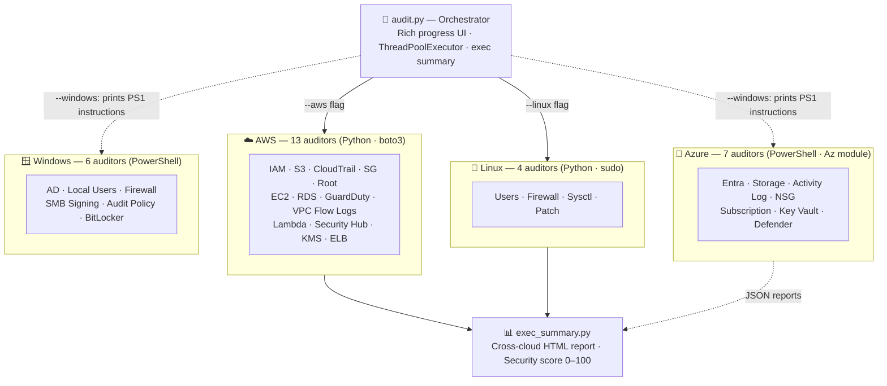

# 🛡️ Security Audit Scripts

[](https://github.com/Decdd19/SecurityAuditScripts/actions/workflows/ci.yml)

A collection of security auditing scripts for AWS, Azure, and on-premises infrastructure. Built for security engineers and sysadmins who want real visibility into their environment without relying on commercial tooling.

> **Purpose:** Practical, standalone scripts that give you real security insight. No agents, no SaaS dependencies — just run and review.

---

## 🗺️ Architecture



---

## 🎯 Audit Orchestrator

`audit.py` runs any combination of Python auditors in parallel with a live Rich progress UI and generates an executive summary on completion.

```bash
# Full AWS + Linux audit for a client
python3 audit.py --client "Acme Corp" --aws --linux --output ./reports/

# Everything — AWS, Linux, plus Azure/Windows PS1 instructions
python3 audit.py --client "Acme Corp" --all --profile prod

# Multi-region AWS scan
python3 audit.py --client "Acme Corp" --aws --regions eu-west-1 us-east-1

# Cherry-pick specific auditors
python3 audit.py --client "Acme Corp" --s3 --ec2 --iam --linux_user

# Print Azure/Windows PS1 run instructions only
python3 audit.py --client "Acme Corp" --windows

# Open executive summary in browser when complete
python3 audit.py --client "Acme Corp" --all --open
```

**Flags:** `--aws` (all 13 AWS) · `--linux` (all 4 Linux) · `--windows` (Azure/Windows PS1 guide) · `--all` (everything) · `--profile` · `--regions` · `--output` · `--format` · `--workers` · `--open`

> **Prerequisites:** `pip install boto3 rich` · AWS credentials configured · Run with `sudo` for Linux auditors

---

## 📁 Repository Structure

```
SecurityAuditScripts/
├── README.md
├── AWS/
│   ├── README.md
│   ├── iam-privilege-mapper/       # IAM users, roles, privilege escalation
│   ├── s3-auditor/                 # S3 bucket public access, encryption, versioning
│   ├── cloudtrail-auditor/         # CloudTrail coverage and logging gaps
│   ├── sg-auditor/                 # Security group open ports and ingress rules
│   ├── root-auditor/               # Root account MFA, access keys, password policy
│   ├── ec2-auditor/                # EC2 IMDS v2, EBS encryption, public IPs, snapshots
│   ├── rds-auditor/                # RDS public access, encryption, backups, multi-AZ
│   ├── guardduty-auditor/          # GuardDuty enablement, findings, protection plans
│   ├── vpcflowlogs-auditor/        # VPC flow log coverage, traffic type, retention
│   ├── lambda-auditor/             # Lambda public URLs, IAM roles, secret env vars
│   ├── securityhub-auditor/        # Security Hub enablement, findings, standards
│   ├── kms-auditor/                # KMS CMK rotation, key policy, state, aliases
│   └── elb-auditor/                # ALB/NLB access logging, TLS policy, WAF, HTTPS
├── tools/
│   └── exec_summary.py             # Cross-cloud executive summary report (aggregates all JSON reports)
├── Azure/
│   ├── README.md
│   ├── entra-auditor/              # Entra ID MFA, guest roles, app credentials, privesc
│   ├── storage-auditor/            # Storage account public access, encryption, soft delete
│   ├── activitylog-auditor/        # Activity Log diagnostic settings and alerting
│   ├── nsg-auditor/                # NSG open ports, orphaned groups
│   ├── subscription-auditor/       # Defender for Cloud, PIM, Global Admin hygiene
│   ├── keyvault-auditor/           # Key Vault RBAC, soft delete, secret/cert/key expiry
│   └── defender-auditor/           # Defender for Cloud plans, secure score, contacts
└── OnPrem/
    ├── README.md
    ├── Windows/
    │   ├── ad-auditor/             # Active Directory hygiene, Kerberoasting, delegation
    │   ├── localuser-auditor/      # Local users, registry, NTLM, LAPS, WDigest
    │   ├── winfirewall-auditor/    # Firewall profiles, open ports, rule analysis
    │   ├── smbsigning-auditor/     # SMB signing enforcement, NTLM relay prevention
    │   ├── auditpolicy-auditor/    # Audit policy subcategories (process, logon, privilege)
    │   └── bitlocker-auditor/      # BitLocker drive encryption status and method
    └── Linux/
        ├── linux-user-auditor/     # Users, sudo, SSH, password policy
        ├── linux-firewall-auditor/ # iptables/nftables/ufw/firewalld, auditd, syslog
        ├── linux-sysctl-auditor/   # Kernel hardening, 24 CIS sysctl parameters
        └── linux-patch-auditor/    # Available updates, auto-update agent, kernel version
```

---

## 🛠️ Scripts

### AWS

| Script | Description | Output |
|--------|-------------|--------|
| [IAM Privilege Mapper](./AWS/iam-privilege-mapper/) | Maps IAM users, roles, and groups. Identifies high-risk permissions, privilege escalation paths, stale credentials, and MFA gaps. | JSON, CSV, HTML |
| [S3 Bucket Auditor](./AWS/s3-auditor/) | Audits all S3 buckets for public access, missing encryption, versioning, logging, and lifecycle policies. | JSON, CSV, HTML |
| [CloudTrail Auditor](./AWS/cloudtrail-auditor/) | Checks CloudTrail coverage across all regions for logging gaps, missing KMS encryption, and CloudWatch integration. | JSON, CSV, HTML |
| [Security Group Auditor](./AWS/sg-auditor/) | Scans all security groups across all regions for dangerous open ports, unrestricted ingress, and unused groups. | JSON, CSV, HTML |
| [Root Account Auditor](./AWS/root-auditor/) | Audits root account security posture including MFA, access keys, password policy, and alternate contacts. | JSON, CSV, HTML |
| [EC2 Auditor](./AWS/ec2-auditor/) | Audits EC2 instances across all regions for IMDSv2 enforcement, EBS encryption, public IPs, public snapshots, IAM instance profiles, and default VPC usage. | JSON, CSV, HTML |
| [RDS Auditor](./AWS/rds-auditor/) | Audits RDS databases for public accessibility, storage encryption, backup retention, deletion protection, IAM authentication, and multi-AZ deployment. | JSON, CSV, HTML |
| [GuardDuty Auditor](./AWS/guardduty-auditor/) | Checks GuardDuty enablement across all regions, active finding counts by severity, protection plan coverage (S3/EKS/Malware/RDS/Runtime), and findings export configuration. | JSON, CSV, HTML |
| [VPC Flow Logs Auditor](./AWS/vpcflowlogs-auditor/) | Audits VPC flow log coverage per VPC per region. Flags missing logs (CRITICAL), ACCEPT/REJECT-only logs, default log format, and short CloudWatch retention periods. | JSON, CSV, HTML |
| [Lambda Auditor](./AWS/lambda-auditor/) | Audits Lambda functions for public function URLs with no auth, overly-permissive IAM roles, secrets in environment variable names, deprecated runtimes, missing DLQs, and X-Ray tracing. | JSON, CSV, HTML |
| [Security Hub Auditor](./AWS/securityhub-auditor/) | Checks Security Hub enablement across all regions, active finding counts by severity, and enabled compliance standards (CIS, PCI DSS, FSBP) with control pass rates. | JSON, CSV, HTML |
| [KMS Auditor](./AWS/kms-auditor/) | Audits customer-managed KMS keys across all regions for disabled rotation, dangerous key policies (public/cross-account wildcard), key state, unaliased keys, and key spec. | JSON, CSV, HTML |
| [ELB Auditor](./AWS/elb-auditor/) | Audits Application and Network Load Balancers for missing access logging, no deletion protection, HTTP→HTTPS redirect gaps (ALB), outdated TLS policies, and missing WAF association (ALB). | JSON, CSV, HTML |

### Cross-Cloud

| Script | Description | Output |
|--------|-------------|--------|
| [Executive Summary](./tools/) | Aggregates JSON reports from all AWS and Azure auditors into a single executive HTML report with an overall security score (0–100), per-pillar risk cards, top findings, and quick wins. | HTML |

### Azure

| Script | Description | Output |
|--------|-------------|--------|
| [Entra Auditor](./Azure/entra-auditor/) | Audits Entra ID users, guest access, app credentials, custom roles, and privilege escalation paths. | JSON, CSV, HTML |
| [Storage Auditor](./Azure/storage-auditor/) | Audits Storage Accounts for public access, shared key auth, encryption, soft delete, versioning, and logging. | JSON, CSV, HTML |
| [Activity Log Auditor](./Azure/activitylog-auditor/) | Checks Activity Log diagnostic settings for coverage, retention, missing categories, and alerting gaps. | JSON, CSV, HTML |
| [NSG Auditor](./Azure/nsg-auditor/) | Scans Network Security Groups for dangerous open ports, internet-exposed rules, and orphaned groups. | JSON, CSV, HTML |
| [Subscription Auditor](./Azure/subscription-auditor/) | Audits subscription posture including Defender for Cloud, permanent privileged roles, Global Admin hygiene, and budget alerts. | JSON, CSV, HTML |
| [Key Vault Auditor](./Azure/keyvault-auditor/) | Audits Key Vaults for RBAC vs legacy access policy, purge protection, soft delete, diagnostic logging, and expired or expiring secrets, certificates, and keys. | JSON, CSV, HTML |
| [Defender Auditor](./Azure/defender-auditor/) | Audits Defender for Cloud plan enablement per resource type, secure score, security contacts, and auto-provisioning of monitoring agents. Supports all subscriptions. | JSON, CSV, HTML |

### On-Premises

| Script | Description | Output |
|--------|-------------|--------|
| [AD Auditor](./OnPrem/Windows/ad-auditor/) | Audits Active Directory for stale accounts, Kerberoastable users, weak password policy, unconstrained delegation, and privileged group hygiene. | JSON, CSV, HTML |
| [Local User Auditor](./OnPrem/Windows/localuser-auditor/) | Audits local accounts, registry autologon, WDigest, NTLMv1, LAPS detection, and local admin group membership. | JSON, CSV, HTML |
| [Windows Firewall Auditor](./OnPrem/Windows/winfirewall-auditor/) | Audits Windows Firewall profiles and rules for disabled profiles, default-allow policies, and dangerous ports open to any source. | JSON, CSV, HTML |
| [Linux User Auditor](./OnPrem/Linux/linux-user-auditor/) | Audits Linux user accounts, sudo rules, SSH configuration, password policy from login.defs, and stale accounts. | JSON, CSV, HTML |
| [Linux Firewall Auditor](./OnPrem/Linux/linux-firewall-auditor/) | Auto-detects and audits iptables/nftables/ufw/firewalld. Also checks auditd rules and syslog configuration. | JSON, CSV, HTML |
| [Linux Sysctl Auditor](./OnPrem/Linux/linux-sysctl-auditor/) | Checks 24 CIS Benchmark kernel parameters via sysctl: network hardening, TCP, ASLR, dmesg restriction, ptrace scope, protected hardlinks/symlinks. | JSON, CSV, HTML |
| [Linux Patch Auditor](./OnPrem/Linux/linux-patch-auditor/) | Auto-detects apt/yum/dnf/zypper and counts available updates (total and security-specific), checks auto-update agent, last update timestamp, and kernel upgrade status. | JSON, CSV, HTML |
| [SMB Signing Auditor](./OnPrem/Windows/smbsigning-auditor/) | Checks SMB signing enforcement on server and client. Missing server-side enforcement allows NTLM relay attacks. | JSON, CSV, HTML |
| [Audit Policy Auditor](./OnPrem/Windows/auditpolicy-auditor/) | Checks 15 critical Windows audit policy subcategories (logon, process creation, privilege use, etc.) against CIS baseline. | JSON, CSV, HTML |
| [BitLocker Auditor](./OnPrem/Windows/bitlocker-auditor/) | Audits BitLocker drive encryption status, encryption method strength, TPM protector, and recovery password configuration. | JSON, CSV, HTML |

---

## ⚙️ General Requirements

### AWS

- Python 3.7+
- `boto3` (`pip install boto3`)
- AWS credentials configured

Authentication order:
1. **AWS CloudShell** — credentials are pre-configured, just upload and run
2. **Environment variables:**
   ```bash
   export AWS_ACCESS_KEY_ID=your_key
   export AWS_SECRET_ACCESS_KEY=your_secret
   export AWS_DEFAULT_REGION=us-east-1
   ```
3. **AWS CLI profile** (`aws configure`) — most scripts support `--profile` flag
4. **IAM role** — if running on EC2/Lambda, the instance/execution role is used automatically

### Azure

- PowerShell 7+
- Az PowerShell module + Microsoft Graph SDK (see each script's README for exact modules)
- Active Az context (`Connect-AzAccount` already run)

```powershell
# Install core Az modules
Install-Module Az.Accounts, Az.Resources, Az.Network, Az.Storage, Az.Monitor, Az.Security, Az.KeyVault -Scope CurrentUser

# Install Graph modules (required by entra-auditor and subscription-auditor)
Install-Module Microsoft.Graph.Authentication, Microsoft.Graph.Users, Microsoft.Graph.Identity.Governance -Scope CurrentUser

Connect-AzAccount
```

### On-Premises

**Windows scripts:**
- PowerShell 5.1+ or 7+
- Run as local administrator (localuser-auditor, winfirewall-auditor)
- RSAT ActiveDirectory module for ad-auditor (domain-joined machine)

**Linux scripts:**
- Python 3.7+
- Run as root (`sudo`) for shadow file and firewall access

---

## 🚀 Quick Start

### Full Audit (Orchestrator)
```bash
git clone https://github.com/Decdd19/SecurityAuditScripts.git
cd SecurityAuditScripts
pip install boto3 rich
sudo python3 audit.py --client "Acme Corp" --all --open --output ./reports/
```

> See the [Audit Orchestrator](#-audit-orchestrator) section above for all flags and examples.

### AWS
```bash
git clone https://github.com/Decdd19/SecurityAuditScripts.git
cd SecurityAuditScripts
pip install boto3

# Run individual auditors
python3 AWS/iam-privilege-mapper/iam_mapper_v2.py --format html --output iam_report
python3 AWS/ec2-auditor/ec2_auditor.py --format all --output ec2_report
python3 AWS/rds-auditor/rds_auditor.py --format all --output rds_report

# Generate cross-cloud executive summary (after running auditors)
python3 tools/exec_summary.py --input-dir . --output exec_summary.html
```

### Azure
```powershell
git clone https://github.com/Decdd19/SecurityAuditScripts.git
cd SecurityAuditScripts
Connect-AzAccount
.\Azure\entra-auditor\entra_auditor.ps1 -Format html
```

### On-Premises (Windows)
```powershell
git clone https://github.com/Decdd19/SecurityAuditScripts.git
cd SecurityAuditScripts
.\OnPrem\Windows\winfirewall-auditor\winfirewall_auditor.ps1 -Format html
.\OnPrem\Windows\localuser-auditor\localuser_auditor.ps1 -Format all
.\OnPrem\Windows\ad-auditor\ad_auditor.ps1 -Format html  # domain-joined only
```

### On-Premises (Linux)
```bash
git clone https://github.com/Decdd19/SecurityAuditScripts.git
cd SecurityAuditScripts
sudo python3 OnPrem/Linux/linux-user-auditor/linux_user_auditor.py --format html
sudo python3 OnPrem/Linux/linux-firewall-auditor/linux_firewall_auditor.py --format all
```

---

## 📌 Notes

- Scripts are **read-only** — they query configuration and do not make any changes to your environment
- AWS scripts are designed to run in **AWS CloudShell**; Azure scripts run in **Azure CloudShell** or locally; OnPrem scripts run directly on the target machine
- Output files are written to the current working directory unless specified otherwise
- All output files are created with owner-only permissions (600)
- AWS scripts support `--format` (json, csv, html, all, stdout) and `--profile` flags; EC2 and RDS auditors also accept `--regions` to limit scope
- Azure scripts support `-Format` (json, csv, html, all, stdout) and `-AllSubscriptions` flags
- OnPrem Windows scripts support `-Format` (json, csv, html, all, stdout)
- OnPrem Linux scripts support `--format` (json, csv, html, all, stdout)

---

## 🤝 Contributing

Feel free to open a PR or raise an issue if you have improvements, bug fixes, or want to add a script for another service.

---

## ⚠️ Disclaimer

These scripts are provided for **internal security auditing purposes only**. Always ensure you have appropriate authorisation before running security tooling against any environment.
